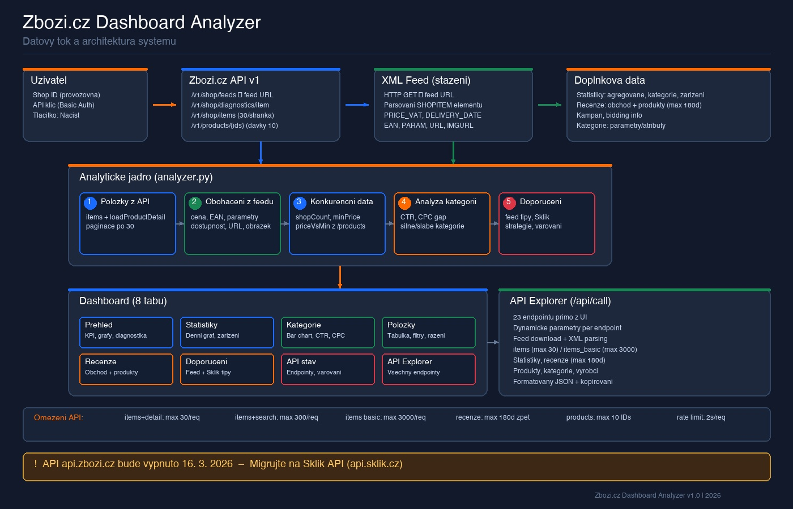

# Zboží.cz Dashboard Analyzer

Webový nástroj pro komplexní analýzu e-shopu na Zboží.cz. Stáhne data přes oficiální API, rozparsuje XML feed a zobrazí přehledný dashboard s doporučeními.



## Co nástroj umí

- **Diagnostika feedu** – chyby, položky ke zlepšení, stav párování
- **Analýza položek** – ceny, EAN, parametry, dostupnost z XML feedu
- **Konkurenční srovnání** – počet eshopů na kartě, poměr cen vůči nejlevnějšímu
- **Statistiky výkonu** – zobrazení, kliknutí, CTR, náklady, konverze (30 dní)
- **Analýza kategorií** – silné/slabé kategorie, CPC gap
- **Recenze** – hodnocení obchodu i produktů
- **Automatická doporučení** – tipy pro feed (XML) i Sklik Nákupy
- **API Explorer** – přímé volání všech 23 endpointů Zboží.cz API z prohlížeče

## Jak to funguje

```
Uživatel zadá Shop ID + API klíč
        ↓
/v1/shop/feeds → získá URL XML feedu
        ↓
Stáhne XML feed → rozparsuje ceny, EAN, parametry, dostupnost
        ↓
/v1/shop/items (po 30) → základní data položek
        ↓
Obohacení položek daty z feedu
        ↓
/v1/products/{ids} → konkurenční data (shopCount, minPrice)
        ↓
Statistiky + recenze + kampaň
        ↓
Dashboard s 8 taby + doporučení
```

## Spuštění

```bash
# 1. Naklonovat
git clone https://github.com/Mikinex/zbozi-analyzer.git
cd zbozi-analyzer

# 2. Vytvořit virtuální prostředí a nainstalovat závislosti
python3 -m venv venv
source venv/bin/activate
pip install -r requirements.txt

# 3. Spustit
python app.py
```

Dashboard běží na **http://localhost:5055**

Nebo jednoduše:
```bash
./start.sh
```

## Potřebné údaje

- **ID provozovny** – najdete v Centru prodejce na Zboží.cz
- **API klíč** – Centrum prodejce → Nastavení → API

Údaje se nikam neukládají, vše probíhá lokálně.

## Screenshoty

### Dashboard – přehled
| KPI dlaždice | Stav položek | Konkurenční analýza |
|:---:|:---:|:---:|
| Celkem, spárováno, chyby, bez EAN/parametrů | Donut graf OK/chyby/zlepšit | Průměr eshopů, cenový poměr |

### Záložky
| Tab | Obsah |
|-----|-------|
| **Přehled** | KPI, grafy, kampaň, feed, diagnostika |
| **Statistiky** | Denní graf výkonu, zařízení, souhrn |
| **Kategorie** | Bar chart, tabulka s CTR a CPC gap |
| **Položky** | Tabulka s filtry (spárované, bez parametrů, dražší) |
| **Recenze** | Hodnocení obchodu + produktové recenze |
| **Doporučení** | Feed/XML tipy + Sklik Nákupy strategie |
| **API stav** | Status endpointů, varování, raw JSON |
| **API Explorer** | Přímé volání všech API endpointů |

## Technologie

- **Backend:** Python 3, Flask
- **Frontend:** Bootstrap 5, Chart.js
- **API:** Zboží.cz API v1 (Basic Auth)
- **Feed:** XML parsing (ElementTree)

## Limity Zboží.cz API

| Omezení | Hodnota |
|---------|---------|
| Položky s detailem | max 30 / request |
| Položky bez detailu | max 3 000 / request |
| Recenze | max 180 dní zpět |
| Produkty / kategorie | max 10 ID najednou |
| Rate limit | 2 sekundy mezi požadavky |

## Upozornění

> **API api.zbozi.cz bude vypnuto 16. 3. 2026.**
> Migrace na [Sklik API](https://api.sklik.cz/).

## Licence

Volně k použití pro vlastní potřebu.
